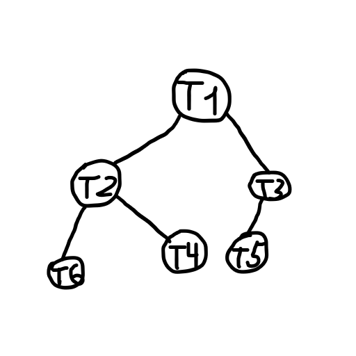

# PowerShell-ThreadTree

This project creates a thread tree, in which every thread writes its name to a file.
Result which appears in file has consistent order.

## Example

For the next example tree:



Result is

*`results.txt` contents:*

```Text
T1
T2
T3
T4
T5
T6
```
